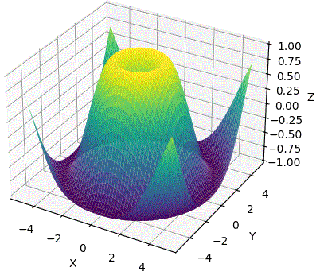

<h2> Hi, I'm Ana! Welcome   </h2>

<em>

Computer Enginner at <a href="https://maua.br/"> Instituto Mauá de Tecnologia </a>  

Former Senior Consultant <a href="https://maua.br/">Mauá Jr</a>  

Former Calculus Tutor <a href="https://mauajr.com/">Instituto Mauá de Tecnologia</a> 

Former Intern at <a href="https://smartcampus.maua.br/"> Research Center at Mauá Institute of Technology  </a>

  
  

<!-- carrd -->

  
 <h2> knowledge and Languages </h2>
 

<!-- https://img.shields.io/badge/<nome_escrito>-<cor_de_fundo?style=for-the-badge&logo=<nome_logo)&logoColor=<cor_do_logo>" target="_blank">
https://www.linkedin.com/pulse/como-criar-badges-figurinhas-personalizadas-github-giacomelli/
https://img.shields.io/badge/<texto_cor_1>-<texto_cor_2>-<cor>?style=for-the-badge
<nome_logo> -> https://simpleicons.org/
-->

  
 <h3> Languages [click here]</h3>
 

<!-- ### Languages -->

  

  
 <h3> Frameworks [click here]</h3>
 

 <!-- https://img.shields.io/badge/Rust-eeeeee?style=for-the-badge&logo=Rust&logoColor=black)  -->

###

  

  
 <h3> IDEs [click here]</h3>
 

  

  
 <h3> Technologies [click here]</h3>
 

<!--  -->

<!--  -->
<!--  -->
<!--  -->
  

### GitHub Statistics 

  <a href="https://www.linkedin.com/in/ana-helena-marcacini-a06387178" >
  	
	
 

 

---

  
 <b> ⭐️ Things to know about me! </b>
 

<h4 align="center">Visitor's count :eyes:</h4>

  

<!--  -->
<!--  -->

<!-- 

 -->

<!--

  
 <h3> Titulo</h3>
 

  
 -->
